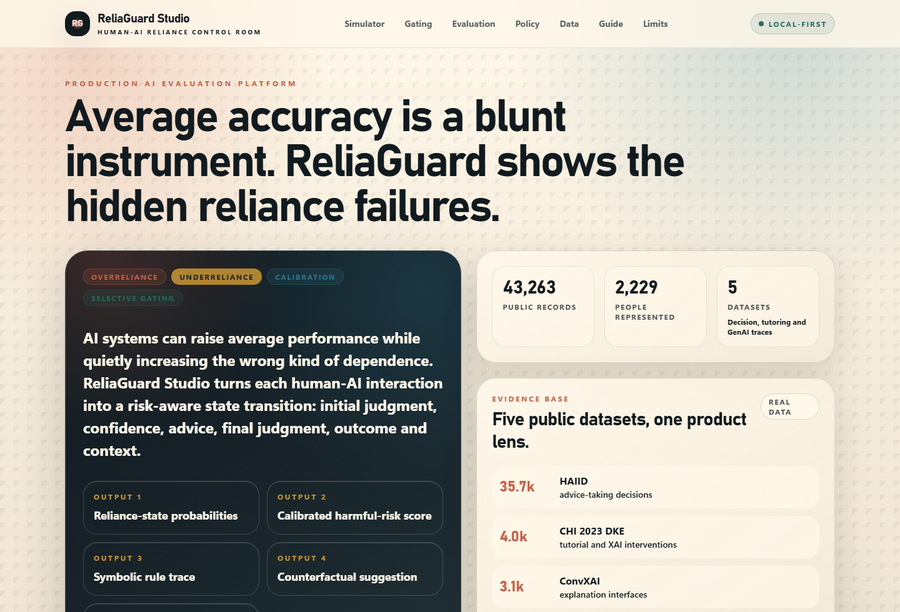
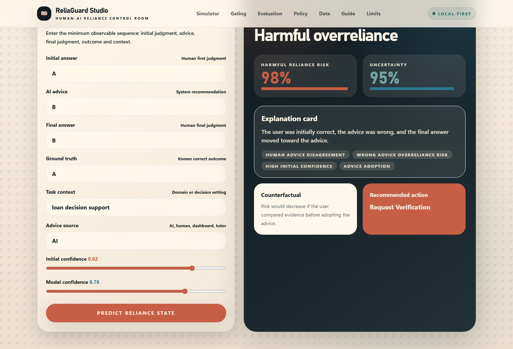
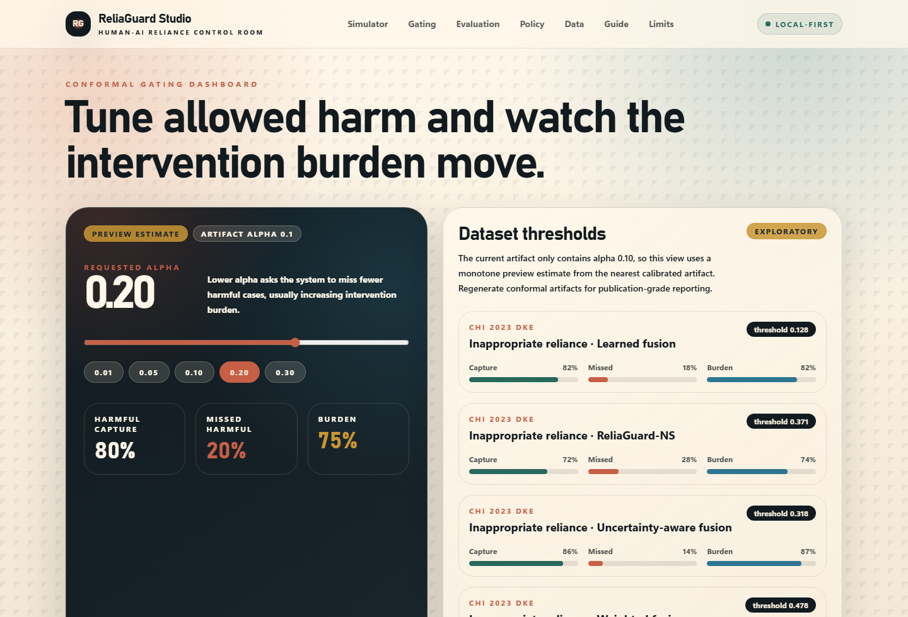
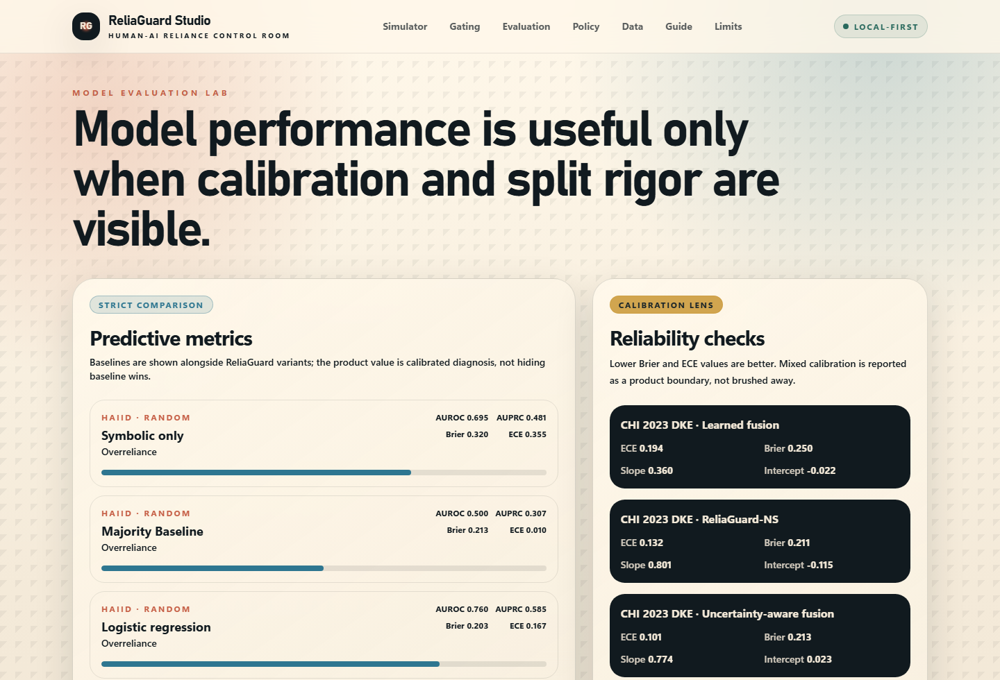

<div align="center">

# ReliaGuard Studio

### Production-style AI evaluation for detecting overreliance, underreliance, and unsafe human-AI decision behavior.

**Average accuracy can improve while reliance quality gets worse. ReliaGuard Studio turns that hidden failure mode into calibrated risk, symbolic explanations, counterfactuals, and selective-gating decisions.**



</div>

## Why This Project Exists

AI assistants are often evaluated by average task accuracy. That misses a product-safety problem: people can accept wrong AI advice, reject correct AI advice, become overconfident after seeing a system output, or improve on average while still creating dangerous reliance failures in specific cases.

ReliaGuard Studio reframes human-AI evaluation around **reliance states**. Given an initial human judgment, confidence, AI advice, final judgment, ground truth, and context, the platform classifies whether the interaction reflects beneficial AI reliance, harmful overreliance, harmful underreliance, correct self-reliance, independent correctness/error, or uncertain disagreement.

The underlying research pipeline integrates **43,263 public records from 2,229 participants/students across five datasets**: HAIID, CHI 2023 DKE, ConvXAI, Pardos/Bhandari ChatGPT tutoring, and FLoRA IPS.

## Product Tour

| Interactive simulator | Conformal gating dashboard |
| --- | --- |
|  |  |

| Model evaluation lab |
| --- |
|  |

The app is designed as a product, not just a research notebook:

- **Case simulator:** score one human-AI decision and inspect state, risk, uncertainty, active rules, counterfactual, and recommended action.
- **Conformal gating dashboard:** move the allowed harmful-miss rate alpha and watch capture, missed harmful cases, and intervention burden change.
- **Evaluation lab:** compare predictive metrics, calibration metrics, reliability summaries, and split rigor.
- **Policy simulator:** compare no gating, confidence thresholds, symbolic-rule gating, and ReliaGuard-NS conformal gating.
- **Safety/limitations panel:** keeps the boundary explicit: this is AI evaluation, not clinical diagnosis or causal proof.

## How The Simulator Works

The simulator is the easiest way to understand the whole project. It converts a single human-AI interaction into a reliance-state trace.

### 1. You enter a decision tuple

The simulator asks for:

- **Initial answer**: the human’s first judgment before seeing advice.
- **Initial confidence**: how confident the human was in that first judgment.
- **AI advice**: the recommendation or answer supplied by the assistant.
- **Final answer**: the human’s final judgment after seeing the advice.
- **Ground truth**: the known correct answer for evaluation.
- **Task context**: a short description such as loan review, medical triage simulation, coding task, or fact-checking task.
- **Advice source**: AI, human, dashboard, tutor, or another support condition.
- **Model confidence**: the confidence/reliability signal attached to the advice.

In compact notation, the simulator reads the interaction as:

```text
(initial answer, initial confidence, advice, final answer, ground truth, context)
```

### 2. ReliaGuard derives basic behavioral signals

The API computes transparent intermediate signals:

- **Initial correctness**: whether the initial answer matches ground truth.
- **Advice correctness**: whether the advice matches ground truth.
- **Final correctness**: whether the final answer matches ground truth.
- **Disagreement**: whether the initial answer and advice differ.
- **Advice adoption**: whether the final answer moved to the advice.
- **Confidence pressure**: whether high human confidence or high model confidence makes the case more brittle.

These signals are intentionally interpretable. They are the bridge between raw interaction logs and reliance-state labels.

### 3. The state engine classifies the reliance pattern

The current product API uses conservative state definitions:

- **Beneficial AI reliance**: the human was initially wrong, the advice was correct, and the final answer adopted the correct advice.
- **Harmful overreliance**: the human was initially correct, the advice was wrong, and the final answer adopted the wrong advice.
- **Harmful underreliance**: the human was initially wrong, the advice was correct, and the final answer failed to adopt the correct advice.
- **Correct self-reliance**: the human was initially correct, the advice was wrong, and the final answer stayed correct.
- **Independent correct**: the final answer is correct without a sharper reliance failure pattern.
- **Independent incorrect**: the final answer is incorrect without a sharper reliance failure pattern.
- **Uncertain disagreement**: the tuple shows disagreement, but available fields do not support a stronger classification.

The screenshot above shows the canonical harmful-overreliance case:

```text
Initial answer = A
AI advice      = B
Final answer   = B
Ground truth   = A
```

The user was right at first, the advice was wrong, and the final decision moved toward the wrong advice.

### 4. ReliaGuard produces calibrated product outputs

For each case, the API returns:

- **Reliance state**: the primary state label.
- **Harmful-reliance risk**: a bounded risk score combining state, disagreement, confidence, and advice pressure.
- **Uncertainty**: how unstable the interpretation is when human confidence and model confidence diverge.
- **State probabilities**: a normalized distribution over reliance states.
- **Active rules**: symbolic triggers such as `wrong_advice_overreliance_risk`, `high_initial_confidence`, and `advice_adoption`.
- **Counterfactual**: a human-readable “what would lower risk?” suggestion.
- **Recommended action**: a candidate intervention such as request verification, compare evidence, show uncertainty cue, or accept advice with trace.

The simulator is not a clinical tool and does not claim that warnings causally change deployed user behavior. It is a product-facing interface for AI evaluation, selective-risk analysis, and prospective intervention design.

## Architecture

```text
apps/web                 Next.js + TypeScript + Tailwind product frontend
apps/api                 FastAPI product API entrypoint
packages/relia_core      Product-facing wrapper for reliance-state scoring
src/reliaguard_studio    Python ML, data, evaluation, rules, API, and visualization source
infra/                   Docker Compose and deployment scaffolding
docs/                    Architecture, usage guide, model cards, portfolio material
tests/                   Unit, integration, policy/statistics, and smoke tests
artifacts/               Ignored generated data/model outputs
paper/                   Ignored manuscript and submission artifacts
.private/                Ignored local-only legacy/reviewer materials
```

## Quickstart

One-command local app launcher on Windows:

```powershell
.\run_app.ps1
```

Or from Command Prompt / double-click:

```bat
run_app.bat
```

Backend only:

```powershell
python -m pip install -e ".[dev]"
uvicorn apps.api.main:app --reload --host 127.0.0.1 --port 8000
```

Frontend only:

```powershell
cd apps/web
npm install
npm run dev
```

Full stack:

```powershell
docker compose -f infra/docker-compose.yml up --build
```

## API Examples

```powershell
Invoke-RestMethod http://127.0.0.1:8000/model-card
Invoke-RestMethod http://127.0.0.1:8000/datasets
Invoke-RestMethod "http://127.0.0.1:8000/conformal-threshold?alpha=0.20"
```

Reliance prediction:

```powershell
Invoke-RestMethod http://127.0.0.1:8000/predict-reliance `
  -Method Post `
  -ContentType "application/json" `
  -Body '{"initial_answer":"A","initial_confidence":0.82,"ai_advice":"B","final_answer":"B","ground_truth":"A","task_context":"loan review","advice_source":"AI","model_confidence":0.78}'
```

## Reproduce Screenshots

The README images are generated from the live local app using headless Chromium. No browser window is opened.

```powershell
cd apps/web
npm install
npx playwright install chromium
cd ../..
node scripts/capture_readme_screenshots.mjs
```

Screenshot outputs:

```text
docs/assets/screenshots/01-homepage.png
docs/assets/screenshots/02-simulator-result.png
docs/assets/screenshots/03-gating-dashboard.png
docs/assets/screenshots/04-evaluation-lab.png
```

## Reproduce The Public Analysis Pipeline

These commands download/prepare public data into ignored `artifacts/` folders and regenerate public analysis artifacts.

```powershell
nsca search-datasets
nsca download-real-data
nsca prepare-real-data
nsca run-real-experiments
nsca run-cross-dataset
nsca run-policy-evaluation
nsca run-conformal-risk-control
nsca run-off-policy-evaluation
nsca run-sensitivity-analyses
nsca run-negative-controls
nsca run-leakage-audit
pytest
python -m compileall src
```

## Evidence Boundaries

Supported:

- Decision reliance, overreliance, underreliance, correct self-reliance, confidence movement, and outcome changes where dataset fields support them.
- Short-term tutoring learning-gain analysis for the public tutoring dataset.
- Observational GenAI process-trace analysis for FLoRA.
- Calibration, cross-dataset transfer limits, rule ablations, and non-causal policy simulation.

Not supported:

- Clinical or diagnostic claims.
- Cognitive decline claims.
- Delayed recall, transfer, or long-term learning claims.
- Claims that showing a ReliaGuard warning causally changes deployed human behavior without a prospective randomized validation study.

## Project Summary And Portfolio Material

- Complete project summary PDF: `docs/project_summary/project_summary.pdf`
- Usage guide: `docs/USAGE_GUIDE.md`
- Architecture docs: `docs/architecture.md`
- Model card: `docs/model_cards/reliaguard_ns.md`
- Portfolio and resume copy: `docs/portfolio/README.md`
- Deployment guide: `docs/deployment.md`

## Publishing As A New GitHub Repository

This project should be published as a new repository named `ReliaGuard-Studio`. See [docs/GITHUB_SETUP.md](docs/GITHUB_SETUP.md) for first-push commands and privacy checks.

This public repository is intentionally product/code-first. Manuscript source, generated paper figures, raw downloaded datasets, prepared participant-level data, reviewer materials, and private audits are ignored so they are not accidentally published.

Before pushing to GitHub:

```powershell
git status --ignored
git check-ignore -v paper artifacts .private CLAIMS_CHECKLIST.md
```

Choose a repository license and update `CITATION.cff` before public release.
